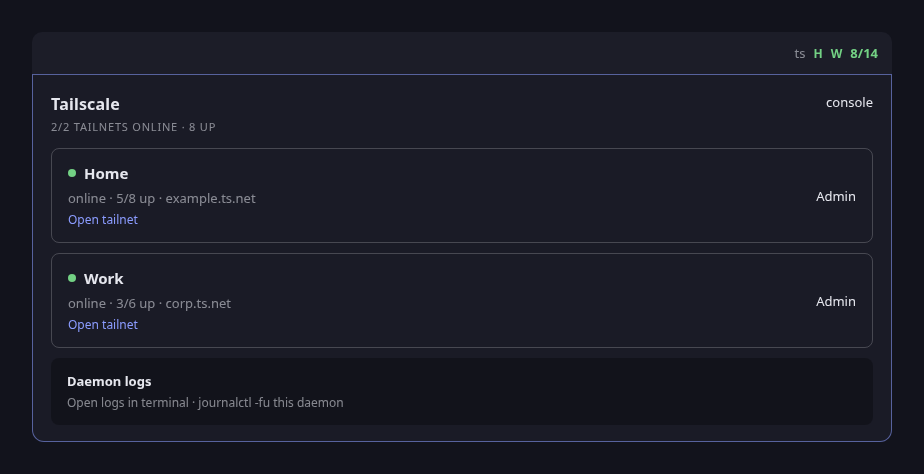
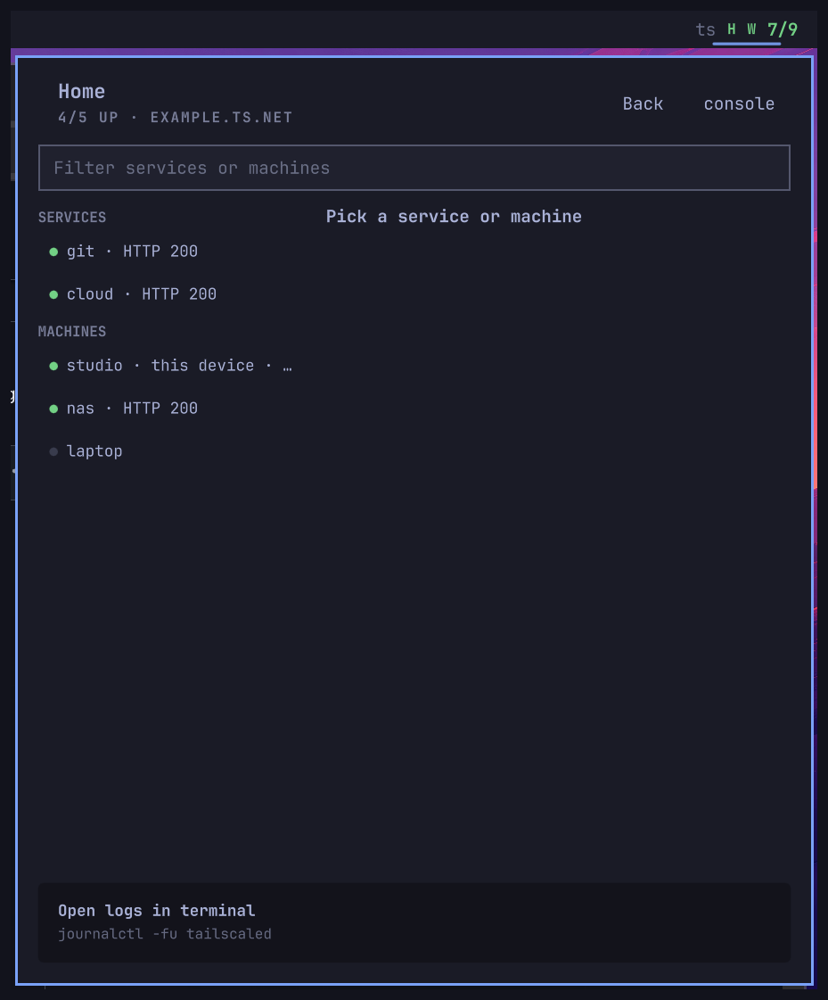

# blitz.tailscale





Omarchy bar chip for Tailscale. Uses whatever account `tailscale status` is logged into, plus any extra `/run/tailscale-*.sock` daemons (a second tailnet, a userspace instance, etc.). No account names are hardcoded.

```bash
omarchy plugin add https://github.com/itz4blitz/blitz.tailscale.git --enable
omarchy plugin update blitz.tailscale
```

## Services

Two sources fill the SERVICES section, in order:

1. **Tagged nodes.** Any peer carrying ACL tags (`tag:server`, `tag:unraid`, …)
   is a service in Tailscale's own model. Nothing to configure.
2. **`services.json`.** Service-only nodes can be hidden from your machine's
   peer list by ACLs, so the client cannot enumerate them. If your panel is
   missing nodes you know are registered, list their MagicDNS hostnames per
   daemon next to the collector:

   ```bash
   cp services.json.example services.json
   ```

   ```json
   {"default": ["git", "vault"], "work": ["ci", "docs"]}
   ```

   Keys are daemon ids (`default` for the main `tailscaled`, the socket suffix
   for extra daemons). The chip probes each listed host over HTTPS and shows
   the response code in the detail card; DNS decides its online dot.

`services.json` is gitignored user config — keep your hostnames there, not in
the collector or its tests.

```bash
python3 test_tailscale_collect.py
```
